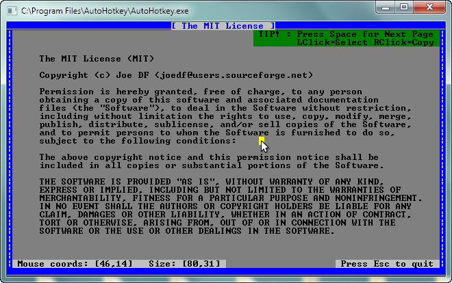

LibCon : Examples
=====================================

##Table of Contents##
- [Example 1 : Simple Usage](#example-1--simple-usage)
- [Example 2 : GUI Interaction](#example-2--gui-interaction)
- [Example 3 : Advanced Usage](#example-3--advanced-usage)
- [ScreenShots](#screenshots)
  

####**_Example 1 : Simple Usage_**####

----
Description:
> This example shows how to display text on the console, as well as get text from the user. It also shows how to set the text color, background color. Provides a usage example of the intergrated progress bar function.  

>Essentially, all the basics of CLI (Command-Line Interface).

Functions used:

- SmartStartConsole()
- Puts(), Putsf(), Print(), Printf()
- NewLine()
- Pause()
- Gets(), Getch()
- SetFgColor()
- sProgressBar()
- PrintColorTable()
- FreeConsole()

[View Source](https://github.com/joedf/LibCon.ahk/blob/master/Example.ahk)  
[View ScreenShot](#example-1--preview)  
 

####**_Example 2 : GUI Interaction_**####

----
Description:
> This example is basically a follow-up of example 1. It shows how to the interaction between GUI and CLI can be implemented.  

>Essentially, a deeper look at the "basics".

Functions used:

- SmartStartConsole()
- Puts(), Putsf(), Print()
- Gets()
- GetConsoleInputCP(), GetConsoleOutputCP()

[View Source](https://github.com/joedf/LibCon.ahk/blob/master/Example2.ahk)  
 

####**_Example 3 : Advanced Usage_**####

----
Description:
> This example is was originally implemented to push the limits of LibCon a little further than the "basics". It involves a DOS style GUI, similar to Word 5.5a using "text-based GUI". This considered a more profound example. It has been simplified and commented greatly to demonstration the basic concept of "drawing" in the console, or otherwise, "GUI drawing".

>Essentially, an example that takes a deeper look at the more advanced console functions.

Functions used:

- StartConsole()
- GetConsoleSize(), SetConsoleSize()
- SetColor(), GetColor()
- GetConsoleCursorInfo(), SetConsoleCursorInfo()
- SetConsoleCursorPos()
- GetConsoleMode(), SetConsoleMode()
- Puts(), Putsf(), Print(), Printf()
- NewLine()
- GetFontWidth(), GetFontHeight()
- GetConsoleWidth()
- GetConsoleClientHeight()
- ClearScreen()
- FillConsoleOutputAttribute()
- ReadConsoleOutputAttribute()

[View Source](https://github.com/joedf/LibCon.ahk/blob/master/Example3.ahk)  
[View ScreenShot](#example-3--preview)  
 

####**_ScreenShots_**####

----

#####Example 1 - Preview#####
  
 
#####Example 3 - Preview#####
  
 