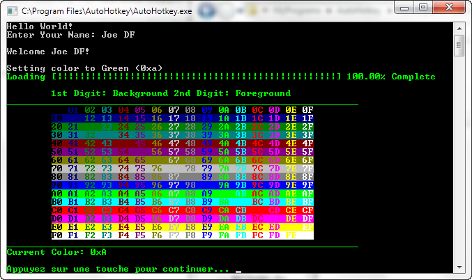

LibCon
======================================================
AutoHotkey Library For Console Support
------------------------------------------------
I have made a simple library, it is not Ultra advanced code, but it is simply like a "wrapper" for basic interaction with a console.
The goal is to maintain simplicity, so that the common AutoHotkey user may use it easily and integrate it. ;)
I know that this is probably considered far from complete, (I do) but just to get things started, here it is!
  
------------------------------------------------
preview of example.ahk 
  
------------------------------------------------
[Contact Me](mailto:joedf@users.sourceforge.net) for Requests, Comments, Contributions, etc.